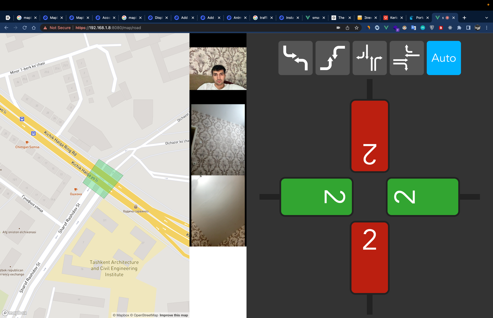

## TUIT Roboticslab jamoasi UrbanTech 2022 dagi loyihasi

### Loyiha nomi - Smart Svetofor

Foydalanilgan texnologilar: Vuejs, Nodejs, Socket.io

Bu loyihaning prototipi hisoblanadi, real qurilmada boshqa texnologiyalar ishlatiladi

Svetofor prototipi uchun smartphonelardan foydalanilyapti vaqtincha, real foydalanishga tushgandan so'ng
Maxsus plata ishlab chiqamiz, buning uchun ham bizning mutaxasisslar bor.

Kamerada kelayotgan rasmlar hozircha faqat ko'rish uchun ishlatilyapti, keyin esa AI va Computer vision yordamida
Smart svetafor, radar, chiziqni nazorati, va boshqa tekshiruvlarni amalga oshira olamiz

